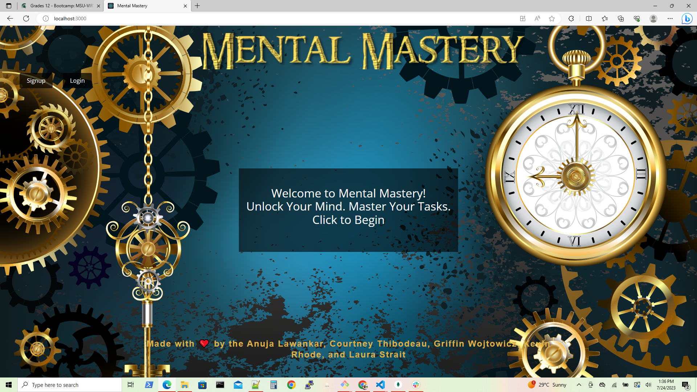
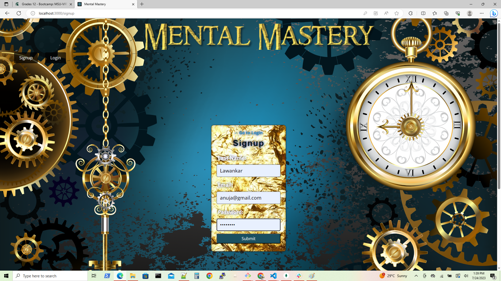
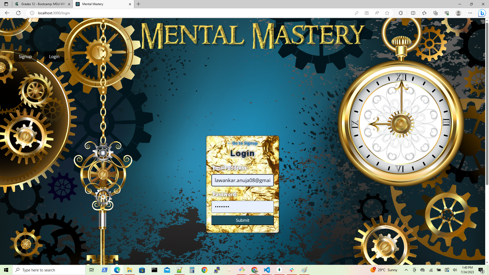
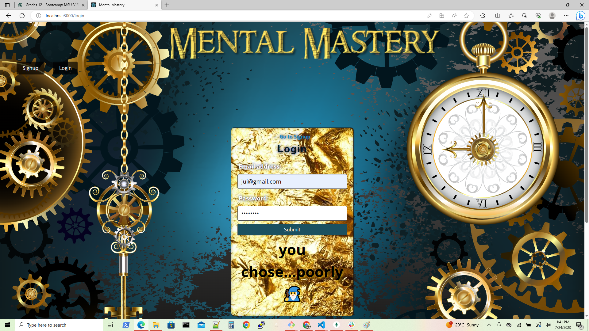
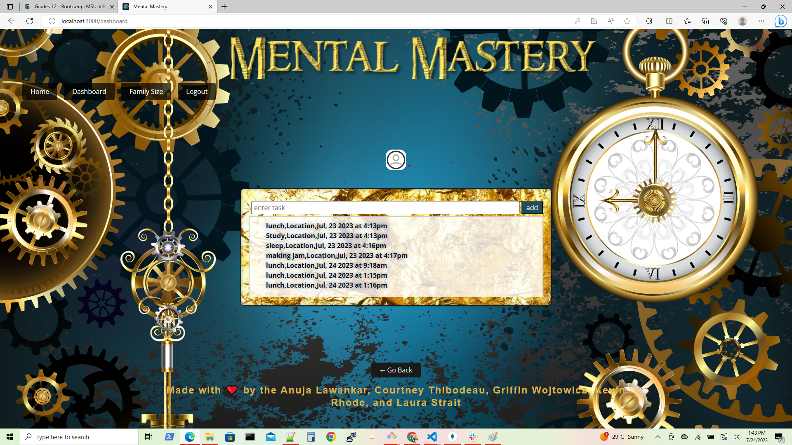
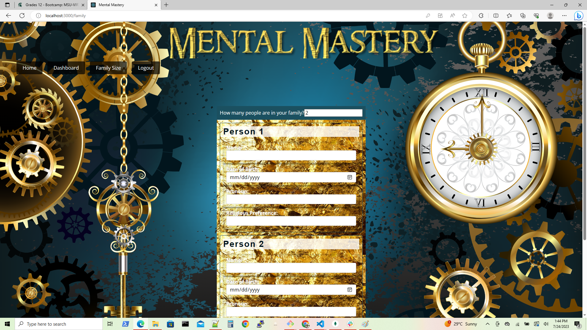
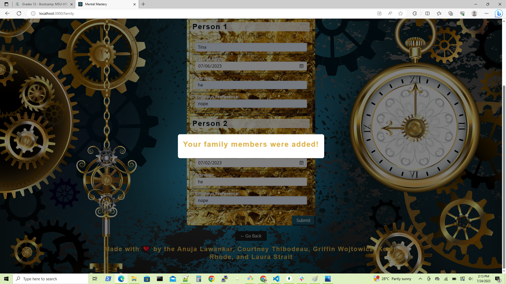

## Mental Mastery - Family Scheduling and Task Application

## Description
Mental Mastery is a collaborative MERN-stack single-page application designed to solve the challenges faced by families in managing their schedules and tasks. The application provides a user-focused platform that allows families to coordinate their activities, assign tasks, and stay organized.

## Table of Contents

 *  [Installation](#installation)
 *  [Deployment URLs](#DeploymentURLs)
 *  [Technologies Used](#TechnologiesUsed)
 *  [Features](#Features)
 *  [Assets](#Assets)
 *  [Testing](#testing)
 *  [License](#license)

## Installation

1. Install inquirer, please use npm i inquirer@8.2.4.
2. npm run build
3. npm run develop

## Deployment URLs

Here, you can find deployed link,

https://mental-mastery-e769c968cd78.herokuapp.com/

Here, you can find the GitHub repo link,

https://github.com/KevinRhode/Mental-Mastery

## Technologies Used
React (Front-end framework)
GraphQL (API)
Node.js and Express.js (Server)
MongoDB (Database)
Mongoose ODM (Object Data Modeling)
JWT (JSON Web Tokens for authentication)
Heroku (Deployment platform)

## Features
User Authentication: Mental Mastery implements JWT for secure user authentication, ensuring that only authorized individuals can access the application and its features.
Family Scheduling: Users can create and manage their family schedules, including events, appointments, and recurring tasks. The application provides a calendar view for easy visualization and planning.
Task Management: Families can assign tasks to specific members and track their completion. Task lists can be created, and reminders can be set to ensure timely completion.
Data Manipulation: Mental Mastery supports queries and mutations to retrieve, add, update, and delete data. Users can easily modify their schedules, tasks, and user information.
Responsive UI: The application features a polished and responsive user interface, ensuring a seamless experience across different devices and screen sizes.

## Assets:-

The following images demonstrates the application's appearance:

1. The landing page of Mental Mastery web application

2. The signup page of Mental Mastery web application

3. The login page of Mental Mastery web application

4. If the user filled the wrong credentials. Then the validation message is displayed.

5. The home page of Mental Mastery web application

6. The dashboard page of Mental Mastery web application. Where the familyuser can list the tasks. if the user click on profile picture of family user. Then each user personal information is also displayed in this tab. 

7. In the family size tab the user can add the count of family. where he can allow to add personal information of each family user.

8. Family user information is add successfully

## Credits

[Adding Webbook, from PWA Text](https://stackoverflow.com/questions/65396446/how-to-add-workbox-to-react-post-update)

## Testing

1. Stop server by using command "ctrl c"
2. Now restart server by using command "npm run develop"
3. To test client separately run the command from client directory "npm run start"
4. To test server separately run the command from server directory "npm run start" 

## License
This project is licensed under the MIT License.
